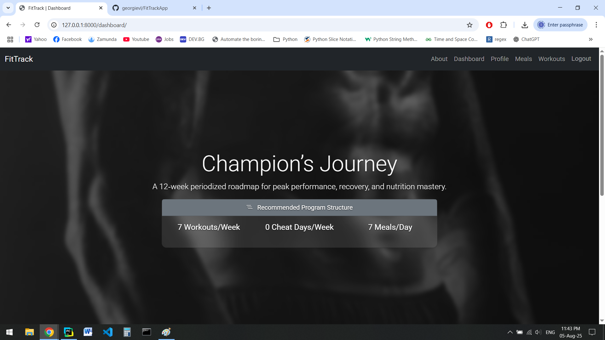
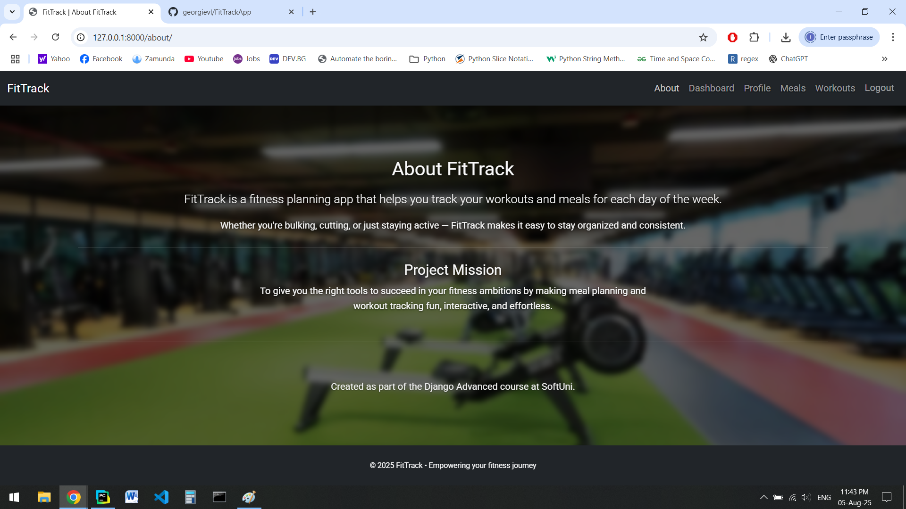
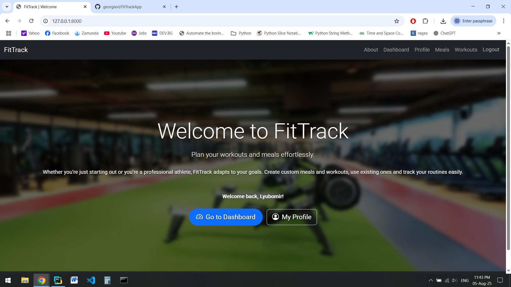

# 🏋️‍♂️ FitTrack

**FitTrack** is a Django web application that helps users plan and track their gym workouts and meals across all 7 days of the week. It provides a clean, responsive interface to manage fitness goals, exercises, meals, and progress.

---

## 🚀 Features

- 🧍 User registration, login, logout, and profile management
- 📅 Daily workout plans with exercises, sets, reps, rest times
- 🍽️ Meal planning with recipes and calorie counts
- 🧠 Personalized dashboard showing today's plan
- ✏️ Create, update, and delete workouts and meals
- 📱 Mobile-responsive design using Bootstrap 5

---

## 📸 Screenshots





---

## 🛠 Tech Stack

- **Backend**: Django 4.x
- **Frontend**: HTML, CSS, Bootstrap 5
- **Database**: SQLite (for development)
- **Other**: Crispy Forms, Django Messages Framework

---

## ⚙️ Setup Instructions

1. **Clone the repository**  
   ```bash
   git clone https://github.com/your-username/fittrack.git
   cd fittrack
